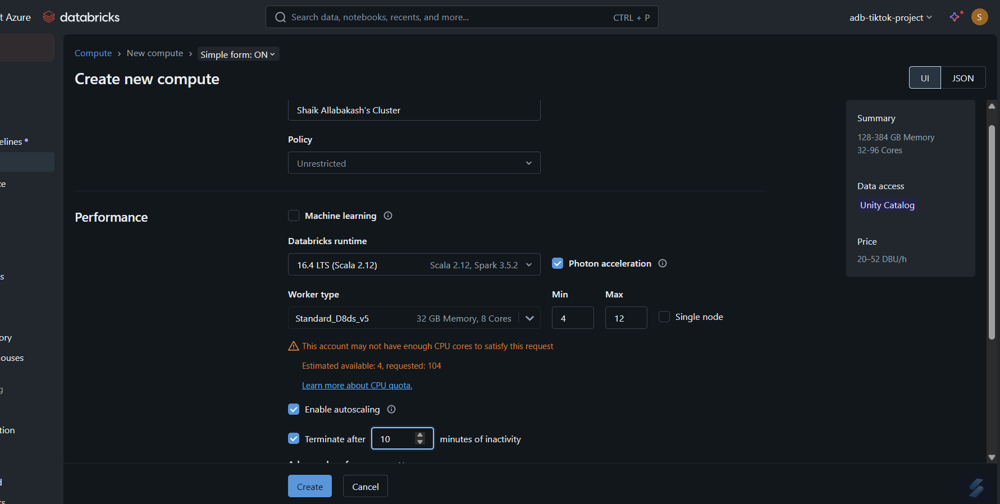
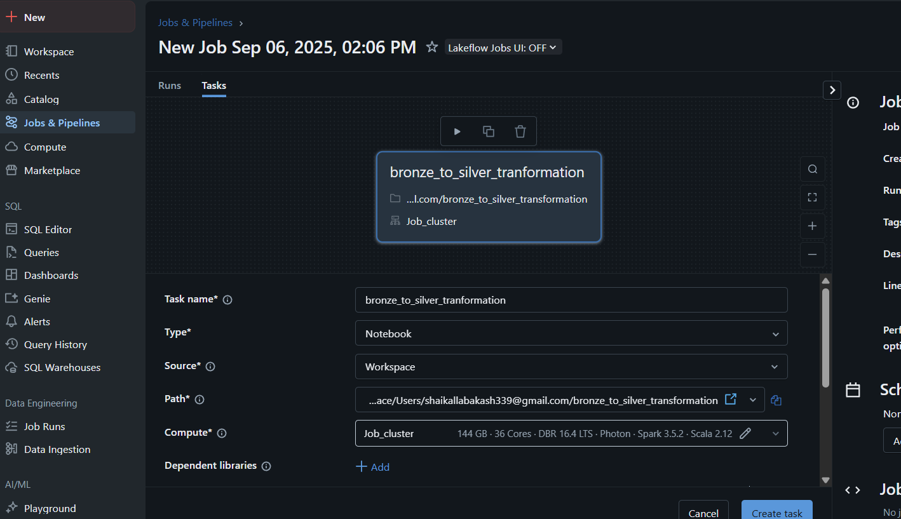

# End-to-End-Azure-Data-Engineering-Project
End-to-End Azure Data Engineering Project using ADF, Databricks, Synapse, and Power BI.

## Table of Contents

- [End-to-End-Azure-Data-Engineering-Project](#end-to-end-azure-data-engineering-project)
  - [Table of Contents](#table-of-contents)
  - [Overview](#overview)
  - [Project Highlights](#project-highlights)
  - [Architecture](#architecture)
  - [Technologies Used](#technologies-used)
  - [Prerequisites](#prerequisites)
  - [Setup Instructions](#setup-instructions)
    - [1. Create an Azure Data Factory Instance](#1-create-an-azure-data-factory-instance)
    - [2. Set Up Azure Data Lake Storage Gen2](#2-set-up-azure-data-lake-storage-gen2)
    - [3. Configure Linked Services in Azure Data Factory](#3-configure-linked-services-in-azure-data-factory)
    - [4. Create Datasets](#4-create-datasets)
    - [5. Build Pipelines](#5-build-pipelines)
    - [6. Transform Data with Azure Databricks](#6-transform-data-with-azure-databricks)
    - [7. Set Up Azure Synapse Analytics](#7-set-up-azure-synapse-analytics)
    - [8. Integrate with Power BI](#8-integrate-with-power-bi)

## Overview

Welcome to the **Azure Data Engineering Project**! This project is designed to aid aspiring data engineers in preparing for the **DP-203: Microsoft Certified Azure Data Engineer Associate** exam. It offers a comprehensive, real-time solution that leverages key Azure services to build an end-to-end data pipeline, providing hands-on experience with essential data engineering tools and best practices.

## Project Highlights

- **Azure Data Factory (ADF):** Created dynamic pipelines to efficiently ingest data from GitHub APIs.
- **Medallion Architecture:** Organized data into Bronze (Raw), Silver (Transformed), and Gold (Serving) layers to ensure quality and accessibility.
- **Azure Databricks:** Performed complex data transformations using Spark to optimize data processing workflows.
- **Azure Synapse Analytics:** Built a robust data warehouse for detailed data analysis and reporting.
- **Power BI Integration:** Connected Synapse Analytics with Power BI to create interactive and insightful dashboards.
- **Dataset Management:** Managed comprehensive datasets with schema validation and data governance best practices.
- **Dynamic Pipelines:** Implemented parameterization and looping to handle multiple datasets dynamically.
- **Real-Time Scenarios:** Addressed practical challenges commonly encountered in data engineering roles and interviews.

## Architecture

The project follows the **Medallion Architecture**, which organizes data into three distinct layers to maintain quality, scalability, and accessibility:

1. **Bronze (Raw) Layer:**
   - **Purpose:** Store raw data as-is from the source without any transformations.
   - **Source:** GitHub APIs.
   - **Tools:** Azure Data Factory.

2. **Silver (Transformed) Layer:**
   - **Purpose:** Clean, transform, and enrich the raw data for analysis.
   - **Tools:** Azure Databricks.

3. **Gold (Serving) Layer:**
   - **Purpose:** Serve refined data to stakeholders through a data warehouse.
   - **Tools:** Azure Synapse Analytics, Power BI.

## Technologies Used

- **Azure Data Factory (ADF):** Orchestration and data integration.
- **Azure Databricks:** Data processing and transformation.
- **Azure Synapse Analytics:** Data warehousing and analytics.
- **Power BI:** Data visualization and reporting.
- **GitHub APIs:** Data source for ingestion.
- **Azure Data Lake Storage Gen2:** Storage solution for raw and processed data.

## Prerequisites

Before you begin, ensure you have met the following requirements:

- **Azure Account:** An active Azure subscription. [Create a free Azure account](https://azure.microsoft.com/free/) if you don't have one.
- **GitHub Account:** To access and interact with GitHub APIs.
- **Basic Knowledge:** Familiarity with Azure services, SQL, Spark, and data engineering concepts.
- **Tools:**
  - **Azure Portal Access**
  - **Azure Resource Group**
  - **Azure Data Factory Studio**
  - **Azure Databricks Workspace**
  - **Azure Synapse Workspace**
  - **Power BI Desktop**

## Setup Instructions

Follow these steps to set up the project environment:

### 1. Create an Azure Data Factory Instance

1. **Navigate to Azure Portal:**
   - Log in to the [Azure Portal](https://portal.azure.com/).
2. **Azure Resource Group** 
   - Navigate to **Resource groups** and click on create a Resource group.
   - Click **"Create"** and fill in the required details:
     - **Subscription:** Choose your Azure subscription.
     - **Region:** Select your preferred region
     - Click **"Review + create"** and then **"create"**.  
       
3. **Create Data Factory:**
   - Click on **"Create a resource"**.
   - Search for **"Data Factory"** and select it.
   - Click **"Create"** and fill in the required details:
     - **Subscription:** Choose your Azure subscription.
     - **Resource Group:** Create a new resource group or select an existing one.
     - **Name:** Enter a unique name (e.g., `tiktokproject-adf`).
     - **Region:** Select your preferred region.
   - Click **"Review + create"** and then **"Create"**.
      

### 2. Set Up Azure Data Lake Storage Gen2

1. **Create Storage Account:**
   - In the Azure Portal, click on **"Create a resource"**.
   - Search for **"Storage account"** and select it.
   - Click **"Create"** and fill in the details:
     - **Subscription:** Your Azure subscription.
     - **Resource Group:** Same as Data Factory.
     - **Storage account name:** Unique name (e.g., `tiktokprojectadls`).
     - **Performance:** Standard.
     - **Account kind:** StorageV2 (general-purpose v2).
     - **Replication:** Locally-redundant storage (LRS) or as per your preference.
     - **Data Lake Storage Gen2:** Enable hierarchical namespace.
   - Click **"Review + create"** and then **"Create"**.
      

2. **Create Containers:**
   - Navigate to your storage account.
   - Under **"Data storage"**, click on **"Containers"**.
   - Create three containers named:
     - `bronze`
     - `silver`
     - `gold`
       

### 3. Configure Linked Services in Azure Data Factory

1. **Access ADF Studio:**
   - Navigate to your Data Factory instance.
   - Click on **"Launch Studio"** to open Azure Data Factory Studio.

2. **Create Linked Services:**
   - Go to the **"Manage"** tab.
   - Under **"Connections"**, select **"Linked services"**.
   - Click **"+ New"** and create the following linked services:
     - **HTTP Linked Service:**
       - **Connector:** HTTP
       - **Name:** `Tiktok_api_linked_connection`
       - **Base URL:** `https://raw.githubusercontent.com/YourGitHubUsername/YourRepoName/main/`
       - **Authentication Type:** Anonymous
       - **Test Connection** and **Create**.
          
     - **Azure Data Lake Storage Gen2 Linked Service:**
       - **Connector:** Azure Data Lake Storage Gen2
       - **Name:** `Azure_data_lake_connection`
       - **Storage Account Name:** Select your storage account.
       - **Test Connection** and **Create**.
        

### 4. Create Datasets

1. **Source Dataset (HTTP):**
   - Go to the **"Author"** tab.
   - Under **"Datasets"**, click **"+ New"**.
   - Select **"HTTP"** as the data source.
   - **Name:** `api_connection_dataset`
   - **Linked Service:** `Tiktok_api_linked_connection`
   - **File Format:** DelimitedText (CSV)
   - **Relative URL:** Leave blank for parameterization.
   - **Schema:** Import schema from a sample file if available.
   - **Parameters:** Add a parameter for `relativeURL`.
   - **Dynamic Content:** Use the `relativeURL` parameter in the dataset.

2. **Sink Dataset (ADLS Gen2):**
   - Click **"+ New"** under **"Datasets"**.
   - Select **"Azure Data Lake Storage Gen2"**.
   - **Name:** `api_to_bronze_container_dataset`
   - **Linked Service:** `Azure_data_lake_connection`
   - **File Format:** DelimitedText (CSV)
   - **Folder Path:** Parameterized for Bronze, Silver, and Gold layers.
   - **Parameters:** Add parameters for `folderPath` and `fileName`.
   - **Dynamic Content:** Use the parameters in the dataset.

### 5. Build Pipelines

1. **Static Pipeline (Initial Setup):**
   - Under **"Pipelines"**, click **"+ New pipeline"**.
   - **Name:** `Tiktok_Project_pipeline`
   - **Activities:**
     - **Copy Activity:**
       - **Name:** `API_to_bronze_layer`
       - **Source:** `api_connection_dataset` with the specific `relativeURL`.
         
       - **Sink:** `api_to_bronze_container_dataset` pointing to the `bronze` container.
         
   - **Debug and Publish:** Test the pipeline and publish your changes.
   - **Add Trigger:** add a trigger a schedule a pipeline Daily from Start Date.
   - Navigate to Adls Bronze Container and see the csv file is loaded or not. once the file is loaded successfully. Staging layer is done.
      

### 6. Transform Data with Azure Databricks

1. **Create Databricks Workspace:**
   - In the Azure Portal, create an **Azure Databricks** workspace.
   - Launch the workspace and create a new cluster.
2. **Create Databrikcs Workspace:**
   - Click on **"Create a resource"**.
   - Search for **"Databricks"** and select it.
   - Click **"Create"** and fill in the required details:
     - **Subscription:** Choose your Azure subscription.
     - **Resource Group:** Create a new resource group or select an existing one.
     - **Name:** Enter a unique name (e.g., `Tiktok_project_resource_group`).
     - **Region:** Select your preferred region.
     - **Pricing Tier** Premium/Standard/Basic Free tier Depend on your plan. I recommend to choose Premium.
   - Click **"Review + create"** and then **"Create"**.
      
   - Once the deployment is complete, Launch the Databrikcs workspace.
   - create a new cluster in the compute tab with following requirements as follows.
   - 
   - upto Cluster start, we need some configurations to setup with databricks. 
   - **Connecting ADLS Storage to Databricks** navigate to Azure Portal and search for **Microsoft Intra Id**. In the left side menu bar. Click On **App Registration**, Register a App with tiktok-project-app with requirements as shown below
   
   - **Copy the Details of Your  Register App** application id, tenant id
   - **Create a Client Secret** Navigate to Secret tab in App Register. Create a Client Secret. Copy the value in one place. 
   - Paste your credentials in Databricks notebooks to connect further. 
   - **Assign a IAM role in ADLS Storage Account** Navigate to your storage account IAM Policies. Add role Assignment with user and select previous app register name. Click on **Review + assign** 

3. **Develop Transformation Scripts:**
   - Import data from the `bronze` layer.
   - Perform data cleaning, enrichment, and transformations using Databricks notebook. 
   - Write transformed data to the `silver` layer.
4. **Configure the Job Cluser:**
   - Navigate to **jobs & Pipelines**. Create a job with notebook attached. Choose the cluster configuration Depend on your data size. Schedule a time to run the job in Every Day 
   - 

### 7. Set Up Azure Synapse Analytics

1. **Create Synapse Workspace:**
   - In the Azure Portal, create an **Azure Synapse Analytics** workspace.
   
   - once the deployment completed. launch the synapse studio.
   - Navigate to **Data tab** in left side menu in Synapse Studio. Create a  **Serverless SQL Pool** as Shown.
   
   - upon the creation of SQL Pool. We need setup Storage Account with Synapse. Navigate to Storage 
   Account IAM role assinment. 
   - Add a **role assignment** with Manage Identity of Synpase Workspace
   
   - add another **role assignment** with user for your default gmail account.
   
  

2. **Ingest Data:**
   - Load transformed data from the `silver` layer into Synapse.
   - Navigate to **Develp** tab & create a new sql script. 
   - start your Scripts to Create a External Table and Views on top of Synapse.Refer this  for creating a Credentials to access from adls, views and External Tables.
   - Create necessary tables and views for analysis.

### 8. Integrate with Power BI

1. **Connect Synapse to Power BI:**
   - Open **Power BI Desktop**.
   - Click on **Get Data** tab. Search for **Synapse Analytics**. Copy paste your Synapase endpoint URL in the Synapse Workspace. Enter the Your Synapse user name & passwords.
   - Import data and create interactive dashboards.

2. **Publish Dashboards:**
   - Publish your Power BI reports to the Power BI service for sharing with stakeholders.
   

